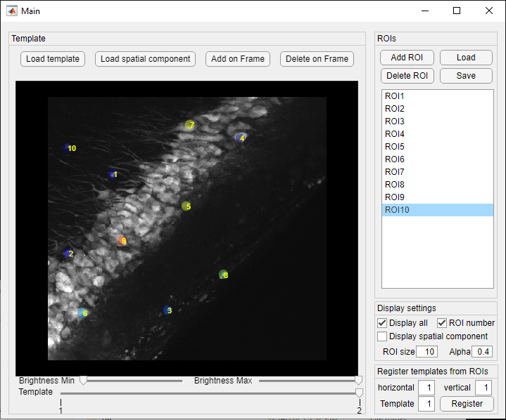

# manual-multisession-alignment
A simple tool for manually track neurons across days.

This is a MATLAB GUI for manually tracking the same neurons across multiple session/days. Test run on Matlab2018b works fine. Still under more testing/development. The GUI displays a set of image templates, and allows you to interactively add new ROIs, and edit their locations individually on each of the templates.

Functions:
Template panel:
- Load template: choose a .mat file that contains image templates. Templates have to be stored in a cell array named 'template'; each cell has the template (2d matrix) from a separate day/session.
  Templates can be viewed by scrolling the middle wheel of the mouse.
- Load spatial component: choose a .mat file that contains pre-defined spatial components for each day. Spatial components have to be stored in a cell array (1 x template number) named 'ROI_mask'. Each cell has two fields: ROI_mask{n}.cont is a number_of_neuron x 1 cell array, containing contour points for each active cell region; ROI_mask{n}.cent is a number_of_neuron x 2 matrix, containing centroids of neurons. This is not required for manually tracking neurons, but it's required for ROI-based registration.
- Add on Frame (keyboard shortcut: a): when clicked/pressed a, you can click anywhere on the current template and create/edit the location of current ROI (new ROIs must be added first from the right panel).
- Delete on Frame (keyboard shortcut: d): when clicked/pressed d, you can delete the location of the current ROI on this frame.

ROI panel:
- Add ROI: add new ROI to the listbox
- Delete ROI: delete current ROI
- Load: load a ROI file; must contain a variable named 'roi_coord'; it should be a number of ROI x number of template x 2 matrix, containing coordinates of each ROI on each template. Missing ROIs are stored as NaNs.
- Save: save current results. The result will be saved in variable 'roi_coord', as described above.

Display settings panel:
You can choose to display all ROIs (display all checkbox), display ROI number (ROI number checkbox), and view spatial components. ROI display size and transparency can also be adjusted (it does not have any effect on the results, the results simply store center location of each ROI).

Register templates from ROIs:
if you have annotated the same neurons (at least 4) across templates, you can perform an ROI-based template registration here. Template will be matched to a chosen one using manually tracked ROIs as landmarks. Spatial components (need to be loaded) will also be transformed. The result will be shown in a new window, and ROIs that are spatially close enough across templates will be assigned to the same neuron (stored in a variable 'roi_list' with shape number_unique_neuron x number_template). Neurons that can't be found is stored as NaN. The next figure also provide tools to visualize assigned neurons.
Note that the manually annotated neurons don't have to be found in all templates. Templates are matched to the adjacent ones, therefore only the neurons that are tracked in two adjacent templates will be used for registering these two templates. All templates and spatial components are transformed to the chosen template number in the end.

